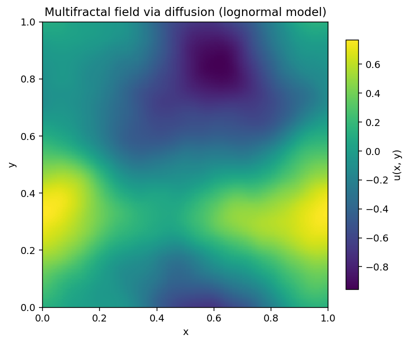
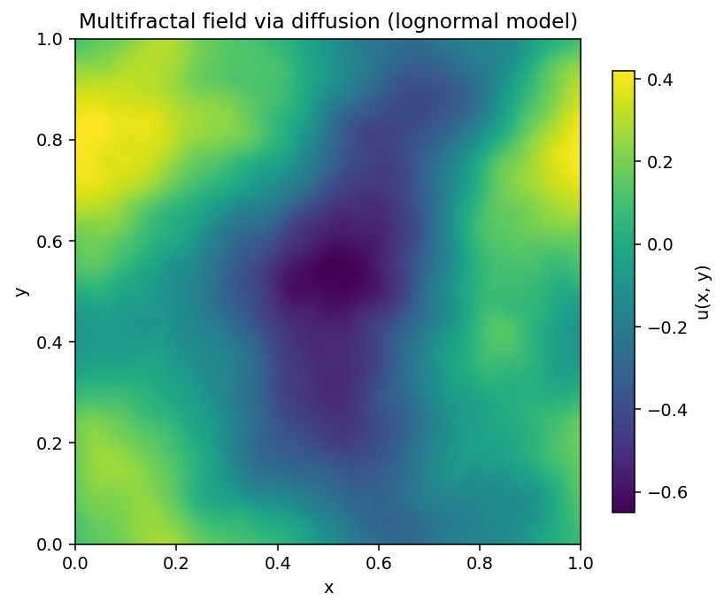
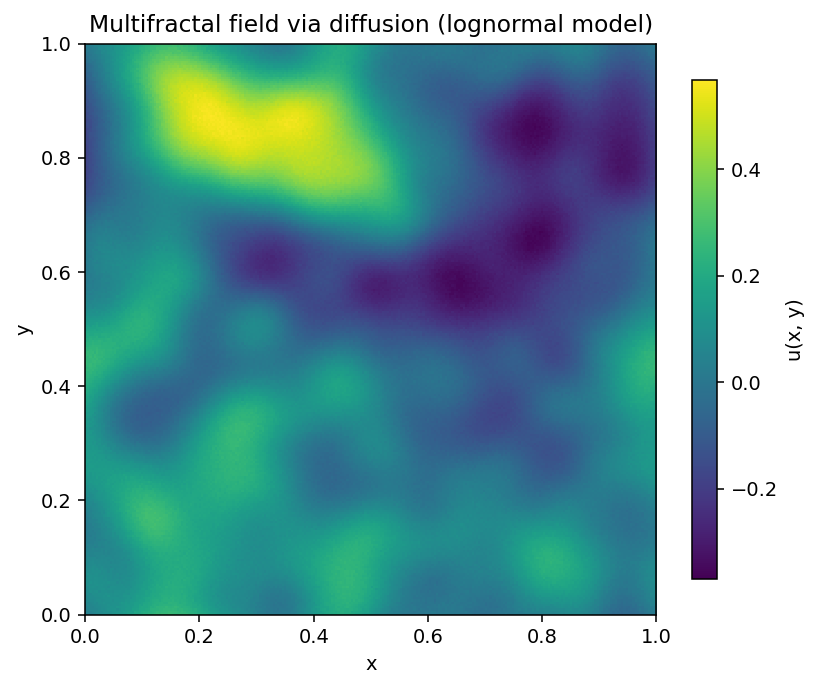

# Fractal Diffusion Field

Generate 2D multifractal random fields directly from the lognormal statistics of
Warnecke et al. (2024), *An ensemble of Gaussian fields with multifractal
statistics for turbulence* (arXiv:2509.19622). This package integrates the
probability-flow ODE associated with a variance-preserving diffusion SDE whose
score is analytic, so no neural training is required.

## Highlights
- Reproducible implementation of the lognormal multifractal model from Sec. 4 of
  the reference paper.
- Deterministic diffusion sampler that produces exact Gaussian-mixture draws for
  each mixture latent.
- CLI for fast experimentation plus a Python API for deeper integration.
- Matplotlib helper that saves images of sampled fields.
- Tested with Python 3.9+; ships with pytest-based regression checks.

## Demo

A few samples generated with identical grid resolution but varied statistics.

Regenerate these figures with `python examples/generate_demo_images.py`.


*Baseline lognormal parameters (seed 42) with moderate intermittency.*


*Stronger intermittency (`sigma_h = 0.35`) sharpens gradients and small-scale bursts.*


*Reducing the integral scale (`L_int = 0.10`) concentrates variance into finer structures.*

## Installation

### From PyPI (once published)
```bash
pip install fractal-diffusion-field
```

### From source
```bash
python -m venv .venv
source .venv/bin/activate
pip install --upgrade pip
pip install -e .[dev]
```

The optional `[dev]` extra installs pytest and linters for development. This
project depends on NumPy and Matplotlib; both are installed automatically.

## Usage

### Command line
```bash
fractal-diffusion-field --nx 256 --ny 256 --steps 500 --output samples/field.png
```

Important flags:
- `--sigma-h` tunes intermittency by widening the singularity spectrum.
- `--L-int` controls the integral scale in box-size units.
- `--no-save` skips writing the PNG; `--show` opens the figure window.
- `--json` prints sampler diagnostics (mixture draw, FFT eigenvalue range, and
  diffusion schedule checkpoint).

All CLI parameters map one-to-one with the `LognormalMultifractalParams`
dataclass thanks to consistent naming.

### Python API
```python
from fractal_diffusion_field import LognormalMultifractalParams, generate_field

params = LognormalMultifractalParams(nx=128, ny=128, steps=400, save_path="field.png")
field, diagnostics = generate_field(params)

print(diagnostics["gamma"])  # mixture latent for this draw
```

Set `generate_field(..., save=False)` to keep computations headless (useful for
batch pipelines or unit tests).

### Library integration
`sample_field_lognormal_diffusion` exposes the raw sampler. Pair it with your
own storage routines or integrate it in a parameter sweep by providing a shared
`numpy.random.Generator` instance.

## Theory at a glance
- The covariance kernel uses Eq. (4.6) from the reference paper with a small
  eigenvalue floor to maintain numerical stability in FFT space.
- The diffusion sampler integrates the deterministic probability-flow ODE
  associated with the variance-preserving SDE (Song et al., 2021). The analytic
  score avoids trained neural networks while recovering the target mixture.
- Each draw corresponds to a single Gaussian component conditioned on a latent
  `gamma ~ N(0, 1)`. Diagnostics expose this latent and the FFT eigenvalue range
  for reproducibility.

## Development
```bash
pip install -e .[dev]
pytest
```

Run the CLI locally while developing:
```bash
python -m fractal_diffusion_field.cli --steps 200 --json
```

## License
MIT License. See `LICENSE` if distributed.
